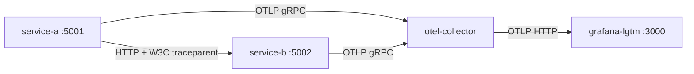
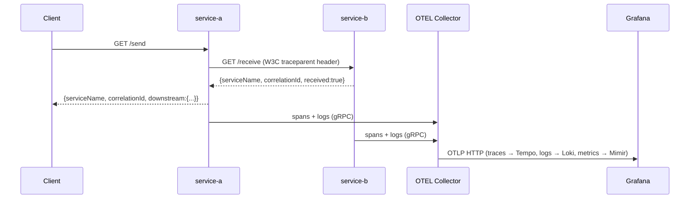
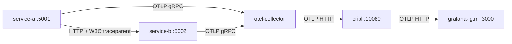

# OTEL POC

A runnable reference implementation of end-to-end [OpenTelemetry](https://opentelemetry.io/) observability across two .NET 10 microservices.

## What this is

This project gives you a fully wired, locally runnable OTEL pipeline you can inspect, break, and learn from. Use it to:

- **Validate** how traces, logs, and metrics flow from a .NET service through a collector to a Grafana backend
- **Demonstrate** cross-service trace correlation (a single trace ID spanning two services)
- **Experiment** with an optional Cribl Stream processing layer between the collector and Grafana
- **Bootstrap** OpenTelemetry integration in a new .NET 10 service by using this as a reference

## The stack

| Component | Role |
|---|---|
| **.NET 10 API** | Two identical service instances emitting OTEL signals (traces, metrics, logs) via the OTEL SDK |
| **OTEL Collector** | Receives telemetry over OTLP/gRPC and forwards it to the backend over OTLP/HTTP |
| **Grafana LGTM** | All-in-one Grafana image: **Loki** (logs) + **Tempo** (traces) + **Mimir/Prometheus** (metrics) |
| **Cribl Stream** *(optional)* | Telemetry pipeline layer — filter, route, enrich, or redact signals before they reach storage |

---

## Prerequisites

- **Docker + Docker Compose** — required to run the full stack
- **.NET 10 SDK** — only needed for local development and running unit tests (the devcontainer provides this automatically)

---

## Default flow

### Architecture



Cross-service trace sequence:



### Running the stack

```bash
docker compose up --build
```

Services start in dependency order: Grafana LGTM → Collector → service-a + service-b.

| Service | Host Port | URL |
|---|---|---|
| Grafana UI | 3000 | http://localhost:3000 |
| service-a | 5001 | http://localhost:5001 |
| service-b | 5002 | http://localhost:5002 |

### Testing & validation

#### Option A — Scalar (interactive API docs)

Both services expose interactive API documentation at `/scalar/v1`:

- service-a: http://localhost:5001/scalar/v1
- service-b: http://localhost:5002/scalar/v1

All endpoints are documented with live **Try it** capability — no curl required. Use the `/send` endpoint to trigger a cross-service trace directly from the browser.

#### Option B — curl

Emit a log:
```bash
curl "http://localhost:5001/log?message=hello-from-a"
```

Trigger a cross-service trace:
```bash
curl http://localhost:5001/send
```

The response includes the downstream service-b reply with a shared `correlationId`.

### Grafana correlation walkthrough

1. Open Grafana at http://localhost:3000 → **Explore**

2. **Logs** — Select the **Loki** datasource. Filter by `{service_name="service-a"}`. Find your log entry and note the `trace_id` field in the log line.

3. **Traces** — Select the **Tempo** datasource. Search by the `trace_id` from step 2. Confirm the trace spans **both** `service-a` (client span for `/send`) and `service-b` (server span for `/receive`) under a single trace ID.

4. **Log ↔ Trace correlation** — In Loki, click the trace link icon next to a log line. Grafana jumps directly to the Tempo trace for that request. This works because the W3C `traceparent` header is propagated automatically by the HttpClient instrumentation, so both services share the same trace ID.

5. **Metrics** — Select the **Prometheus** datasource. Query `http_server_request_duration_seconds_bucket` for HTTP request durations, or `dotnet_gc_collections_total` for runtime metrics. Filter by `service_name` to compare service-a and service-b.

---

## Development

### Devcontainer

Open this repo in VS Code and choose **Reopen in Container**. The devcontainer provides .NET 10 SDK — no local install needed.

### Running tests

```bash
dotnet test
```

The test suite covers all endpoints using xUnit + FluentAssertions with an in-process `WebApplicationFactory` (no running Docker stack required).

### API endpoints

| Method | Path | Description |
|---|---|---|
| `GET` | `/health` | Returns `serviceName`, `instanceId`, `status` |
| `GET` | `/log?message=<text>` | Logs the message via ILogger (appears in Loki) |
| `GET/POST` | `/send` | Calls `/receive` on the other service; returns combined response with shared `correlationId` |
| `GET/POST` | `/receive` | Accepts a call and echoes correlation info |

### Configuration

All behavior is driven by environment variables — no code changes needed to differentiate the two service instances:

| Variable | Purpose |
|---|---|
| `OTEL_SERVICE_NAME` | Service name reported in all telemetry |
| `SERVICE_INSTANCE_ID` | Unique instance identifier |
| `OTEL_EXPORTER_OTLP_ENDPOINT` | OTLP collector endpoint |
| `OTEL_EXPORTER_OTLP_PROTOCOL` | `grpc` or `http/protobuf` |
| `SEND_TARGET_URL` | Base URL of the service that `/send` calls |
| `ASPNETCORE_ENVIRONMENT` | ASP.NET Core environment name |

---

## Enabling Cribl (optional)

### What is Cribl Stream?

[Cribl Stream](https://cribl.io/stream/) is a vendor-agnostic telemetry pipeline tool. It sits between your OTEL Collector and your backend (Grafana), giving you real-time control over telemetry data — filter out noise, redact PII, route signals to multiple destinations, or transform formats on the fly without touching your application code.

In this POC, Cribl acts as a transparent passthrough to demonstrate the integration point. The configuration is fully pre-loaded via mounted YAML files — no manual UI setup required.

### Architecture



### Running the stack with Cribl

```bash
docker compose -f docker-compose.yml -f docker-compose.cribl.yml --profile cribl up --build
```

Additional port exposed:

| Service | Host Port | URL |
|---|---|---|
| Cribl UI | 9000 | http://localhost:9000 |

### Testing & validation

1. Trigger a cross-service trace:
   ```bash
   curl http://localhost:5001/send
   ```

2. **Grafana → Tempo** — confirm the trace appears. This proves Cribl received the telemetry from the collector and forwarded it to Grafana.

3. **Grafana → Loki** — confirm logs are visible with matching `trace_id`.

4. **Cribl UI** at http://localhost:9000:
   - Navigate to **Sources** → confirm events/sec > 0 on the OTLP source (port 10080)
   - Navigate to **Destinations** → confirm events/sec > 0 on the Grafana LGTM destination

See [deploy/cribl/README.md](deploy/cribl/README.md) for details on the pre-configured pipeline files.
